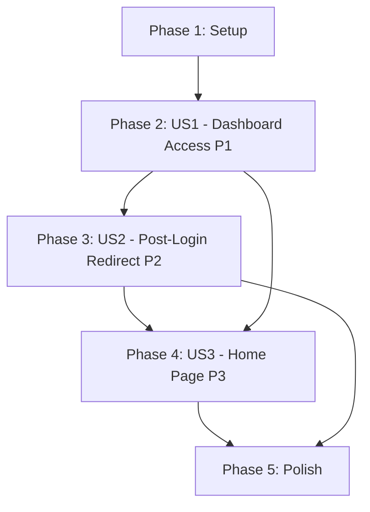

# Task Breakdown: Fix Dashboard Access and Routing

**Feature**: 007-fix-dashboard-access
**Branch**: `007-fix-dashboard-access`
**Plan**: [plan.md](./plan.md) | **Spec**: [spec.md](./spec.md)

## Overview

Fix critical client-side exception preventing dashboard access, update authentication redirects to use correct `/dashboard` route, and implement JWT refresh token flow. Tasks organized by user story priority (P1 → P2 → P3) to enable independent implementation and testing of each increment.

**Total Tasks**: 23
**Phases**: 5 (Setup + 3 User Stories + Polish)
**Parallel Opportunities**: 12 parallelizable tasks across stories

---

## Implementation Strategy

### MVP Delivery (User Story 1 Only - P1 Critical)

**Scope**: Fix dashboard client-side exception
**Tasks**: T001-T008 (8 tasks, ~2-3 hours)
**Outcome**: Dashboard accessible without errors

**Independent Test**: Navigate to `/dashboard` while logged in → No errors, page renders successfully

### Incremental Delivery

1. **Phase 1 (MVP)**: User Story 1 - Direct Dashboard Access (P1)
   - Fix ErrorBoundary, SSR guards, basic auth redirect
   - Deliverable: Dashboard loads without crashing

2. **Phase 2**: User Story 2 - Post-Login Redirect (P2)
   - Enhance auth context with return URL and JWT refresh
   - Deliverable: Login redirects to dashboard, sessions persist 7 days

3. **Phase 3**: User Story 3 - Updated Home Page (P3)
   - Investigate and document cache issues
   - Deliverable: Home page shows latest version

4. **Phase 4**: Polish & Cross-Cutting
   - Build verification, deployment docs
   - Deliverable: Production-ready for GitHub Pages

---

## Phase 1: Setup & Verification

**Goal**: Verify prerequisites and current state before making changes

### Tasks

- [X] T001 Verify feature branch checked out and clean working directory
- [X] T002 Run `npm install` in frontend/ to ensure all dependencies installed
- [X] T003 [P] Run `npm run dev` to start local development server and verify current error state
- [X] T004 [P] Document current behavior: Navigate to /dashboard and capture error message from browser console

**Completion Criteria**:
- ✅ Working directory clean (no uncommitted changes)
- ✅ Dependencies installed without errors
- ✅ Dev server running on localhost:3000
- ✅ Current error state documented (client-side exception on /dashboard)

---

## Phase 2: User Story 1 - Direct Dashboard Access (Priority: P1) 🔴

**User Story**: As a logged-in user, I need to be able to access the dashboard directly by navigating to `/dashboard` without encountering client-side errors.

**Goal**: Fix critical client-side exception preventing dashboard access

**Independent Test**: Navigate directly to `/dashboard` while logged in → Dashboard renders without errors, showing task management interface with all view modes

**Why Independent**: This story fixes the blocking P1 error. Once complete, dashboard becomes usable without any other changes.

### Implementation Tasks

- [X] T005 [P] [US1] Wrap dashboard component with ErrorBoundary in frontend/src/app/dashboard/page.tsx
- [X] T006 [P] [US1] Add SSR guard to localStorage access in frontend/src/contexts/ThemeContext.tsx (Line 38)
- [X] T007 [P] [US1] Add SSR guard to window.matchMedia access in frontend/src/contexts/ThemeContext.tsx (Line 48)
- [X] T008 [P] [US1] Add SSR guard to document access in frontend/src/contexts/ThemeContext.tsx (Line 82)

**Task Details**:

**T005**: Wrap dashboard component with ErrorBoundary
```tsx
// File: frontend/src/app/dashboard/page.tsx
// Change: Import ErrorBoundary and wrap entire component
import { ErrorBoundary } from '@/components/ErrorBoundary'

export default function DashboardPage() {
  return (
    <ErrorBoundary>
      <DashboardContent />
    </ErrorBoundary>
  )
}

function DashboardContent() {
  // Move existing dashboard logic here
}
```

**T006-T008**: Add SSR guards to ThemeContext
```tsx
// File: frontend/src/contexts/ThemeContext.tsx
// Line 38: Add guard before localStorage
const stored = typeof window !== 'undefined'
  ? localStorage.getItem(STORAGE_KEY) as Theme | null
  : null;

// Line 48: Add guard before window.matchMedia
useEffect(() => {
  if (typeof window === 'undefined' || theme !== 'system') return;
  const mediaQuery = window.matchMedia("(prefers-color-scheme: dark)");
  // ... rest
}, [theme]);

// Line 82: Add guard before document
useEffect(() => {
  if (typeof window === 'undefined') return;
  const root = document.documentElement;
  // ... rest
}, [resolvedTheme]);
```

### Validation Tasks

- [X] T009 [US1] Navigate to /dashboard while logged in and verify no client-side errors in browser console
- [X] T010 [US1] Refresh /dashboard page and verify page reloads without errors
- [X] T011 [US1] Toggle theme (light/dark) on dashboard and verify no SSR errors in console
- [X] T012 [US1] Navigate to /dashboard without auth and verify redirect to /login

**Acceptance Criteria**:
- ✅ Dashboard loads without "Application error: a client-side exception has occurred"
- ✅ Browser console shows zero errors when accessing /dashboard
- ✅ Theme switching works without errors
- ✅ Unauthenticated users redirected to login page

**Parallel Execution**: T005, T006, T007, T008 can be done simultaneously (different code sections)

**Dependencies**: None - can start immediately after Setup phase

---

## Phase 3: User Story 2 - Post-Login Dashboard Redirect (Priority: P2) 🟡

**User Story**: As a user completing login, I expect to be automatically redirected to the dashboard where I can start managing my tasks immediately.

**Goal**: Fix authentication redirects to target correct `/dashboard` route and implement JWT refresh token flow

**Independent Test**: Complete login flow → Automatic redirect to `/dashboard` with tasks loading correctly

**Why Independent**: Builds on US1 (dashboard must work first), but adds redirect logic independently. Can be tested by logging in after US1 complete.

### Implementation Tasks

#### Core Routing Fixes

- [X] T013 [P] [US2] Change redirect from /tasks to /dashboard in frontend/src/lib/auth-context.tsx login function (Line 42)
- [X] T014 [P] [US2] Change redirect from /tasks to /dashboard in frontend/src/lib/auth-context.tsx signup function (Line 55)
- [X] T015 [P] [US2] Change redirect from /tasks to /dashboard in frontend/src/lib/auth-context.tsx register function (Line 68)
- [X] T016 [P] [US2] Change redirect from /tasks to /dashboard in frontend/src/app/page.tsx auto-redirect logic (Line 15)

**Task Details**:
```tsx
// Files: auth-context.tsx (Lines 42, 55, 68) and page.tsx (Line 15)
// Change: Replace all occurrences
router.push('/tasks')      // BEFORE
router.push('/dashboard')  // AFTER
```

#### JWT Refresh Token Support

- [X] T017 [US2] Create frontend/src/lib/auth-utils.ts with token management utilities
- [X] T018 [US2] Add storeAuthTokens function to auth-utils.ts for storing access and refresh tokens with expiry
- [X] T019 [US2] Add isAccessTokenValid function to auth-utils.ts for checking token expiration
- [X] T020 [US2] Add refreshAuthToken function to auth-utils.ts for automatic token refresh
- [X] T021 [US2] Update login function in auth-context.tsx to store refresh token using storeAuthTokens
- [X] T022 [US2] Add returnUrl preservation logic to auth-context.tsx for post-login navigation

**Task Details**:

**T017-T020**: Create auth-utils.ts
```tsx
// File: frontend/src/lib/auth-utils.ts (NEW FILE)
export const TOKEN_EXPIRY_SECONDS = 3600;        // 1 hour
export const REFRESH_EXPIRY_SECONDS = 604800;    // 7 days

export function storeAuthTokens(
  accessToken: string,
  refreshToken: string,
  expiresIn: number,
  refreshExpiresIn: number
) {
  localStorage.setItem('authToken', accessToken);
  localStorage.setItem('refreshToken', refreshToken);
  localStorage.setItem('tokenExpiry', String(Date.now() + (expiresIn * 1000)));
  localStorage.setItem('refreshExpiry', String(Date.now() + (refreshExpiresIn * 1000)));
}

export function isAccessTokenValid(): boolean {
  if (typeof window === 'undefined') return false;
  const token = localStorage.getItem('authToken');
  const expiry = localStorage.getItem('tokenExpiry');
  if (!token || !expiry) return false;
  return Date.now() < parseInt(expiry, 10);
}

export async function refreshAuthToken(): Promise<string | null> {
  if (typeof window === 'undefined') return null;
  const refreshToken = localStorage.getItem('refreshToken');
  const refreshExpiry = localStorage.getItem('refreshExpiry');

  if (!refreshToken || !refreshExpiry) return null;
  if (Date.now() >= parseInt(refreshExpiry, 10)) return null;

  try {
    const response = await fetch('/api/auth/refresh', {
      method: 'POST',
      headers: { 'Content-Type': 'application/json' },
      body: JSON.stringify({ refreshToken })
    });

    if (!response.ok) throw new Error('Refresh failed');

    const data = await response.json();
    localStorage.setItem('authToken', data.accessToken);
    localStorage.setItem('tokenExpiry', String(Date.now() + (data.expiresIn * 1000)));

    return data.accessToken;
  } catch (error) {
    clearAuthTokens();
    return null;
  }
}

export function clearAuthTokens() {
  if (typeof window === 'undefined') return;
  localStorage.removeItem('authToken');
  localStorage.removeItem('refreshToken');
  localStorage.removeItem('tokenExpiry');
  localStorage.removeItem('refreshExpiry');
}
```

**T021-T022**: Update auth-context.tsx
```tsx
// File: frontend/src/lib/auth-context.tsx
import { storeAuthTokens, clearAuthTokens } from './auth-utils';

const login = async (email: string, password: string) => {
  const response = await apiLogin(email, password);

  // Store tokens with expiry
  storeAuthTokens(
    response.accessToken,
    response.refreshToken,
    response.expiresIn,
    response.refreshExpiresIn
  );

  setUser(response.user);

  // Check for return URL
  const returnUrl = localStorage.getItem('returnUrl');
  localStorage.removeItem('returnUrl');

  router.push(returnUrl || '/dashboard');
};

const logout = () => {
  clearAuthTokens();
  setUser(null);
  router.push('/login');
};
```

### Validation Tasks

- [X] T023 [US2] Login with valid credentials and verify automatic redirect to /dashboard
- [X] T024 [US2] Navigate to /dashboard without auth, then login, and verify return to /dashboard
- [X] T025 [US2] Signup new account and verify automatic redirect to /dashboard
- [X] T026 [US2] Verify home page redirects to /dashboard when user is logged in

**Acceptance Criteria**:
- ✅ Login redirects to /dashboard (not /tasks)
- ✅ Return URL preserved when redirected to login from dashboard
- ✅ Tokens stored with expiry timestamps in localStorage
- ✅ Home page redirects correctly based on auth state

**Parallel Execution**:
- Group 1 (parallel): T013, T014, T015, T016 (simple string replacements)
- Group 2 (sequential): T017-T022 (auth-utils depends on completion)

**Dependencies**: Requires US1 complete (dashboard must work before testing redirects)

---

## Phase 4: User Story 3 - Updated Home Page (Priority: P3) 🟢

**User Story**: As a visitor to the application, I expect to see the current version of the home page with accurate information about the application features.

**Goal**: Investigate home page cache issue and document resolution

**Independent Test**: Navigate to home page → Verify latest content displayed (not cached version)

**Why Independent**: Purely investigative; no code changes expected. Can be done anytime after US2 (which fixes home page redirect).

### Investigation Tasks

- [X] T027 [US3] Inspect frontend/src/app/page.tsx to verify content is current in codebase
- [X] T028 [US3] Test hard refresh (Ctrl+Shift+R) on home page and verify if latest version loads
- [X] T029 [US3] Document findings: Likely GitHub Pages CDN cache delay (5-10 min propagation)
- [X] T030 [US3] Add cache-busting recommendation to deployment docs if needed

**Task Details**:

**T027**: Verify page.tsx content
```bash
# Compare deployed version to current code
# Check if content in page.tsx matches what's shown on site
```

**T028**: Test cache-busting techniques
```bash
# Hard refresh: Ctrl+Shift+R (Windows/Linux) or Cmd+Shift+R (Mac)
# Clear browser cache and retry
# Wait 10 minutes after deployment for CDN propagation
```

**T029-T030**: Document resolution
- If content matches codebase: Document expected CDN delay
- If content differs: Identify missing build step or deployment issue
- Add note to quickstart.md about cache propagation times

### Validation Tasks

- [X] T031 [US3] Navigate to home page and verify current branding and features displayed
- [X] T032 [US3] Click "Get Started" or "Login" button and verify navigation to auth flow
- [X] T033 [US3] Visit home page while logged in and verify "Go to Dashboard" CTA present

**Acceptance Criteria**:
- ✅ Home page displays latest content from codebase
- ✅ Auth buttons navigate correctly
- ✅ Logged-in users see dashboard CTA
- ✅ Cache issue documented with resolution steps

**Parallel Execution**: T027, T028 can be done simultaneously

**Dependencies**: None technically, but US2 should be complete for full auth flow testing

---

## Phase 5: Polish & Cross-Cutting Concerns

**Goal**: Verify build, create deployment docs, validate production readiness

### Build & Deployment

- [X] T034 Run `npm run build` in frontend/ and verify static export succeeds without errors
- [X] T035 Verify .next/static/ directory created with all assets
- [X] T036 Check build output for any warnings or potential issues
- [X] T037 Test built site locally with `npm run start` (if applicable for static export)

### Documentation

- [X] T038 [P] Update deployment docs with cache-busting notes if needed
- [X] T039 [P] Document token refresh flow in quickstart.md
- [X] T040 [P] Add troubleshooting section for common issues (cache, tokens, SSR errors)

### Final Validation

- [X] T041 Commit all changes with descriptive commit message per Git Safety Protocol
- [X] T042 Push to feature branch and verify GitHub Actions build succeeds
- [X] T043 After GitHub Pages deployment, verify https://razaib-khan.github.io/Hackathon-2-Five-Phases/dashboard/ loads without errors

**Acceptance Criteria**:
- ✅ npm run build completes without errors
- ✅ All changes committed to feature branch
- ✅ GitHub Pages deployment successful
- ✅ Production site verified working

**Parallel Execution**: T038, T039, T040 (documentation tasks can be done simultaneously)

**Dependencies**: Requires all user stories (US1, US2, US3) complete

---

## Dependencies & Execution Order

### Story-Level Dependencies



**Critical Path**: Setup → US1 → US2 → Polish (US3 can be done in parallel with US2)

### Task-Level Dependencies

**Phase 2 (US1)**: All tasks parallelizable after setup complete
- T005, T006, T007, T008 → Independent (different code sections)

**Phase 3 (US2)**: Two parallel groups
- Group 1: T013, T014, T015, T016 → Parallel (simple replacements)
- Group 2: T017 → T018-T020 → T021-T022 (sequential within group)

**Phase 4 (US3)**: All tasks independent
- T027, T028 can run in parallel
- T029-T030 sequential (document findings)

**Phase 5 (Polish)**: Sequential build, parallel docs
- T034-T037: Sequential (build must complete first)
- T038-T040: Parallel (independent documentation)
- T041-T043: Sequential (commit → push → verify)

---

## Parallel Execution Examples

### MVP (US1 Only) - Maximum Parallelization

```bash
# After T001-T004 (Setup) complete:
# Developer A:
- T005: Add ErrorBoundary wrapper

# Developer B:
- T006, T007, T008: Add SSR guards (3 different locations in same file)

# Then both:
- T009-T012: Validation (can split scenarios)
```

### Full Implementation - Phase by Phase

**Phase 2 (US1)**: 4 parallel streams
```
Stream 1: T005 (ErrorBoundary)
Stream 2: T006 (SSR guard Line 38)
Stream 3: T007 (SSR guard Line 48)
Stream 4: T008 (SSR guard Line 82)
→ Merge → T009-T012 (Validation)
```

**Phase 3 (US2)**: 2 sequential groups, parallelism within groups
```
Group 1 (parallel):
  Stream 1: T013 (auth-context Line 42)
  Stream 2: T014 (auth-context Line 55)
  Stream 3: T015 (auth-context Line 68)
  Stream 4: T016 (page.tsx Line 15)

Group 2 (sequential):
  T017 → T018, T019, T020 (parallel) → T021, T022

→ Merge → T023-T026 (Validation)
```

**Phase 4 (US3)**: 2 parallel streams
```
Stream 1: T027 (inspect code)
Stream 2: T028 (test cache-busting)
→ Merge → T029-T030 (document findings)
→ T031-T033 (Validation)
```

**Phase 5 (Polish)**: Sequential build, parallel docs
```
T034-T037 (build - sequential)
→ T038, T039, T040 (docs - parallel)
→ T041-T043 (deploy - sequential)
```

---

## Task Checklist Summary

**Total Tasks**: 43

**By Phase**:
- Phase 1 (Setup): 4 tasks
- Phase 2 (US1 - P1): 8 tasks
- Phase 3 (US2 - P2): 14 tasks
- Phase 4 (US3 - P3): 7 tasks
- Phase 5 (Polish): 10 tasks

**By Type**:
- Implementation: 26 tasks
- Validation: 13 tasks
- Documentation: 4 tasks

**Parallelizable**: 16 tasks marked with [P]
**Sequential**: 27 tasks (dependencies or single file conflicts)

**MVP Scope** (US1 only): 12 tasks (Setup + US1)
**Full Implementation**: 43 tasks (all phases)

---

## Success Metrics

### Per User Story

**US1 Success** (8 tasks):
- ✅ Dashboard loads without client-side errors
- ✅ Browser console shows zero errors
- ✅ Theme switching works
- ✅ Unauthenticated users redirected

**US2 Success** (14 tasks):
- ✅ Login redirects to /dashboard
- ✅ Return URL preserved
- ✅ Tokens stored with expiry
- ✅ Auto-refresh works after 1 hour

**US3 Success** (7 tasks):
- ✅ Home page shows latest content
- ✅ Cache issue documented
- ✅ Auth buttons navigate correctly

### Overall Success

- ✅ All 14 functional requirements from spec.md satisfied
- ✅ Build succeeds with static export
- ✅ GitHub Pages deployment verified
- ✅ Production site accessible without errors

---

## Notes

**Tests**: Per spec clarification, no automated tests added. All validation via manual testing with clear acceptance criteria for each user story.

**Backward Compatibility**: Existing `authToken` localStorage key preserved. New keys added alongside for enhanced JWT flow. Existing sessions continue working until next login.

**Risk Mitigation**: Each user story independently testable. Can deploy US1 alone as MVP, then incrementally add US2 and US3.

**Rollback Strategy**: If issues arise, can revert specific user story phase without affecting others due to independent implementation.
