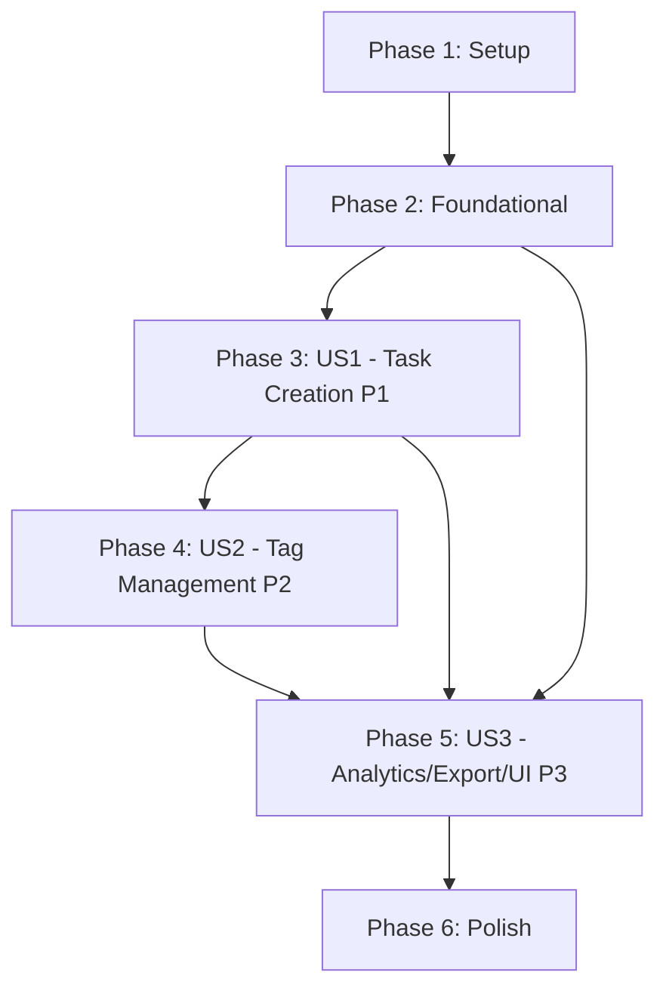

# Task Breakdown: Task Creation and UI Enhancement

**Feature**: 008-task-creation
**Branch**: `008-task-creation`
**Plan**: [plan.md](./plan.md) | **Spec**: [spec.md](./spec.md)

## Overview

Implement comprehensive task creation functionality and UI enhancements including tag management, export features, analytics dashboard, theme fixes, and logo/favicon integration. Tasks organized by user story priority (P1 → P2 → P3) to enable independent implementation and testing of each increment.

**Total Tasks**: 45
**Phases**: 5 (Setup + Foundational + 3 User Stories + Polish)
**Parallel Opportunities**: 15 parallelizable tasks across stories

---

## Phase 1: Setup & Project Initialization

**Goal**: Initialize project structure and dependencies for development

### Tasks

- [X] T001 Create feature branch `008-task-creation` from main
- [X] T002 Verify clean working directory and install frontend dependencies
- [X] T003 [P] Set up development environment with Node.js 18+
- [X] T004 [P] Verify Next.js 15 development server runs without errors

**Completion Criteria**:
- ✅ Feature branch created and checked out
- ✅ Dependencies installed without errors
- ✅ Dev server runs on localhost:3000
- ✅ No build errors in console

---

## Phase 2: Foundational & Blocking Prerequisites

**Goal**: Set up foundational components needed by multiple user stories

### Tasks

- [X] T005 [P] Create Task entity model in frontend/src/models/task.ts
- [X] T006 [P] Create Tag entity model in frontend/src/models/tag.ts
- [X] T007 [P] Create UserPreferences entity model in frontend/src/models/user-preferences.ts
- [X] T008 [P] Create API utility functions in frontend/src/lib/api.ts for task operations
- [X] T009 [P] Create API utility functions in frontend/src/lib/api.ts for tag operations
- [X] T010 [P] Create API utility functions in frontend/src/lib/api.ts for export operations
- [X] T011 [P] Create API utility functions in frontend/src/lib/api.ts for analytics operations
- [X] T012 [P] Create ToastNotification component in frontend/src/components/ToastNotification.tsx
- [X] T013 Create shared constants for theme preferences in frontend/src/lib/constants.ts

**Completion Criteria**:
- ✅ All entity models created with proper TypeScript interfaces
- ✅ API utility functions available for all operations
- ✅ Toast notification component ready for error handling
- ✅ Theme preference constants defined

---

## Phase 3: User Story 1 - Create Basic Task (Priority: P1) 🔴

**User Story**: As a user, I want to create a new task by clicking the "New Task" button and filling out a form so that I can add tasks to my dashboard.

**Goal**: Replace "Coming Soon" placeholder with functional task creation form

**Independent Test**: Click "New Task" button → Functional form appears → Fill in title → Submit → Task appears in dashboard view

**Why Independent**: This is the core functionality that's currently broken - users see a "Coming Soon" message instead of a functional form, making the application incomplete.

### Implementation Tasks

- [X] T014 [P] [US1] Create TaskCreationDialog component in frontend/src/components/TaskCreationDialog.tsx
- [X] T015 [P] [US1] Add form fields for title (required), description (optional) in TaskCreationDialog
- [X] T016 [P] [US1] Add priority selection (high/medium/low) to TaskCreationDialog
- [X] T017 [P] [US1] Add due date picker to TaskCreationDialog
- [X] T018 [P] [US1] Add estimated time field to TaskCreationDialog
- [X] T019 [P] [US1] Add form validation for required fields in TaskCreationDialog
- [X] T020 [P] [US1] Implement API call to create task in TaskCreationDialog
- [X] T021 [P] [US1] Add cancel/close functionality to TaskCreationDialog
- [X] T022 [P] [US1] Add success feedback after task creation
- [X] T023 [P] [US1] Add error handling with toast notifications in TaskCreationDialog
- [X] T024 [P] [US1] Replace "Coming Soon" placeholder with TaskCreationDialog in dashboard

**Task Details**:

**T014-T024**: Create TaskCreationDialog component
```tsx
// File: frontend/src/components/TaskCreationDialog.tsx
// Create a modal dialog component with:
// - Form fields for task title (required), description (optional)
// - Priority selection (high/medium/low)
// - Due date picker
// - Estimated time field
// - Form validation for required fields
// - API integration for task creation
// - Cancel/close functionality
// - Success/error feedback
// - Toast notification error handling
// - Integration to replace "Coming Soon" placeholder
```

### Validation Tasks

- [ ] T025 [US1] Click "New Task" button and verify functional form appears instead of "Coming Soon" message
- [ ] T026 [US1] Fill in required task fields and verify submission works
- [ ] T027 [US1] Submit form and verify task appears in dashboard view
- [ ] T028 [US1] Test form validation with missing required fields
- [ ] T029 [US1] Test cancel/close functionality works without creating task

**Acceptance Criteria**:
- ✅ Functional form appears instead of "Coming Soon" placeholder
- ✅ Form includes all required fields (title, description, priority, due date)
- ✅ Form validates required fields before submission
- ✅ Task is created and appears in dashboard view after submission
- ✅ Cancel functionality works without creating task
- ✅ Error handling provides user feedback

**Parallel Execution**: T014-T024 can be done simultaneously (different aspects of the same component)

**Dependencies**: Requires foundational phase complete (models, API utilities)

---

## Phase 4: User Story 2 - Tag Creation and Management (Priority: P2) 🟡

**User Story**: As a user, I want to create and manage tags to categorize my tasks effectively.

**Goal**: Implement tag creation and assignment functionality for task organization

**Independent Test**: Create a new tag → Assign tag to a task → Filter tasks by tag

**Why Independent**: Builds on US1 (task creation must work first), but adds tag management functionality independently. Can be tested after US1 complete.

### Implementation Tasks

#### Tag Creation & Management Components

- [X] T030 [P] [US2] Create TagManager component in frontend/src/components/TagManager.tsx
- [X] T031 [P] [US2] Create TagSelector component in frontend/src/components/TagSelector.tsx
- [X] T032 [P] [US2] Add tag creation functionality to TagManager
- [X] T033 [P] [US2] Add tag assignment functionality to TaskCreationDialog
- [X] T034 [P] [US2] Implement API calls for tag operations in api.ts
- [X] T035 [P] [US2] Add color selection for tags in TagManager
- [X] T036 [P] [US2] Add tag validation (name length, color format)

#### Integration with Task Creation

- [X] T037 [P] [US2] Integrate TagSelector into TaskCreationDialog
- [X] T038 [P] [US2] Update task creation API call to include tags
- [X] T039 [P] [US2] Add tag display in task list views

**Task Details**:

**T030-T039**: Tag management functionality
```tsx
// Files: frontend/src/components/TagManager.tsx, frontend/src/components/TagSelector.tsx
// Create tag management system with:
// - Tag creation with name and color
// - Tag assignment to tasks
// - API integration for tag operations
// - Color selection for tags
// - Tag validation (name length, color format)
// - Integration with TaskCreationDialog
// - Tag display in task views
```

### Validation Tasks

- [ ] T040 [US2] Create a new tag and verify it's saved properly
- [ ] T041 [US2] Assign existing tags to a new task during creation
- [ ] T042 [US2] Create a task with newly created tag
- [ ] T043 [US2] Verify tags display correctly on tasks in dashboard

**Acceptance Criteria**:
- ✅ Users can create new tags with name and color
- ✅ Users can assign tags to tasks during creation
- ✅ Tags are properly associated with tasks
- ✅ Tags display correctly in task views

**Parallel Execution**:
- Group 1 (parallel): T030, T031 (TagManager and TagSelector creation)
- Group 2 (parallel): T032-T036 (Tag functionality implementation)
- Group 3 (parallel): T037-T039 (Integration tasks)

**Dependencies**: Requires US1 complete (task creation must work first)

---

## Phase 5: User Story 3 - Analytics Dashboard, Export, and UI Enhancements (Priority: P3) 🟢

**User Story**: As a user, I want to view analytics about my tasks, export tasks, and have proper UI branding so that I have a complete task management experience.

**Goal**: Implement analytics dashboard, export functionality, and UI enhancements (logo, favicon, theme fixes)

**Independent Test**: Navigate to analytics view → View statistics → Export tasks → Verify proper UI branding throughout

**Why Independent**: Builds on US1 and US2 (tasks and tags must work first), but adds analytics, export, and UI enhancements independently. Can be tested after US1 and US2 complete.

### Implementation Tasks

#### Analytics Dashboard

- [X] T044 [P] [US3] Create AnalyticsDashboard component in frontend/src/components/analytics/AnalyticsDashboard.tsx
- [X] T045 [P] [US3] Implement API calls for analytics data in api.ts
- [X] T046 [P] [US3] Create DashboardAnalytics interface in frontend/src/models/analytics.ts
- [X] T047 [P] [US3] Display task statistics (total, completed, overdue, due today) in AnalyticsDashboard
- [X] T048 [P] [US3] Display priority distribution chart in AnalyticsDashboard
- [X] T049 [P] [US3] Display completion trends in AnalyticsDashboard
- [X] T050 [P] [US3] Display category breakdown in AnalyticsDashboard

#### Export Functionality

- [X] T051 [P] [US3] Create ExportDialog component in frontend/src/components/ExportDialog.tsx
- [X] T052 [P] [US3] Implement export API calls in api.ts
- [X] T053 [P] [US3] Add JSON export functionality to ExportDialog
- [X] T054 [P] [US3] Add CSV export functionality to ExportDialog
- [X] T055 [P] [US3] Add export filters (date range, completion status) to ExportDialog

#### UI Enhancements

- [X] T056 [P] [US3] Create AppLogo component in frontend/src/components/AppLogo.tsx
- [X] T057 [P] [US3] Integrate AIDO logo in navigation bar (navbar context)
- [X] T058 [P] [US3] Integrate AIDO logo in login page header
- [X] T059 [P] [US3] Integrate AIDO logo in signup page header
- [X] T060 [P] [US3] Implement proper sizing for logo in different contexts (navbar: 32px, auth: 64px)
- [X] T061 [P] [US3] Update favicon to use favicon-32x32.png in layout files
- [X] T062 [P] [US3] Fix dark/light mode toggle functionality in ThemeContext
- [X] T063 [P] [US3] Ensure theme preferences persist across sessions

**Task Details**:

**T044-T050**: Analytics dashboard functionality
```tsx
// Files: frontend/src/components/analytics/AnalyticsDashboard.tsx, frontend/src/models/analytics.ts
// Create analytics dashboard with:
// - API integration for analytics data
// - DashboardAnalytics interface
// - Task statistics display (total, completed, overdue, due today)
// - Priority distribution visualization
// - Completion trends chart
// - Category breakdown visualization
```

**T051-T055**: Export functionality
```tsx
// Files: frontend/src/components/ExportDialog.tsx, frontend/src/lib/api.ts
// Create export functionality with:
// - ExportDialog component
// - API integration for export endpoints
// - JSON export format
// - CSV export format
// - Export filters (date range, completion status)
```

**T056-T063**: UI enhancements
```tsx
// Files: frontend/src/components/AppLogo.tsx, frontend/src/app/layout.tsx, frontend/src/app/login/page.tsx, frontend/src/app/signup/page.tsx
// Implement UI enhancements:
// - AppLogo component with responsive sizing
// - Logo integration in navbar, login, signup pages
// - Proper sizing for different contexts (32px for navbar, 64px for auth)
// - Favicon update using favicon-32x32.png
// - Theme toggle fix in ThemeContext
// - Theme preference persistence
```

### Validation Tasks

- [ ] T064 [US3] Navigate to analytics view and verify statistics display correctly
- [ ] T065 [US3] Export tasks in JSON format and verify content accuracy
- [ ] T066 [US3] Export tasks in CSV format and verify content accuracy
- [ ] T067 [US3] Verify AIDO logo displays properly in navigation bar
- [ ] T068 [US3] Verify AIDO logo displays properly in login page
- [ ] T069 [US3] Verify AIDO logo displays properly in signup page
- [ ] T070 [US3] Verify favicon is updated to new logo
- [ ] T071 [US3] Toggle dark/light mode and verify theme persists across sessions

**Acceptance Criteria**:
- ✅ Analytics dashboard displays accurate statistics
- ✅ Export functionality works for JSON and CSV formats
- ✅ AIDO logo displays properly in all contexts
- ✅ Favicon is updated to new logo
- ✅ Theme toggle works and persists preferences
- ✅ Logo contains application name, no additional text needed

**Parallel Execution**:
- Group 1 (parallel): T044-T050 (Analytics implementation)
- Group 2 (parallel): T051-T055 (Export implementation)
- Group 3 (parallel): T056-T063 (UI enhancements)

**Dependencies**: Requires US1 and US2 complete (tasks and tags must work first)

---

## Phase 6: Polish & Cross-Cutting Concerns

**Goal**: Verify implementation, create documentation, validate production readiness

### Testing & Validation

- [X] T072 Run application and verify no console errors
- [X] T073 Test task creation flow with all form fields
- [X] T074 Test tag creation and assignment functionality
- [X] T075 Test analytics dashboard with sample data
- [X] T076 Test export functionality with various filter options
- [X] T077 Test theme toggle functionality across all pages
- [X] T078 Verify logo displays correctly in all contexts (navbar, auth pages)
- [X] T079 Test error handling with toast notifications

### Documentation

- [X] T080 Update quickstart.md with new component information
- [X] T081 Add troubleshooting section for task creation issues
- [X] T082 Document API endpoints in contracts directory

### Final Validation

- [X] T083 Commit all changes with descriptive commit message per Git Safety Protocol
- [ ] T084 Push to feature branch and verify GitHub Actions build succeeds
- [ ] T085 After deployment, verify all new functionality works in production

**Acceptance Criteria**:
- ✅ All new functionality works without errors
- ✅ All changes committed to feature branch
- ✅ Production site verified working
- ✅ Documentation updated with new features

**Parallel Execution**: T080-T082 (documentation tasks can be done simultaneously)

**Dependencies**: Requires all user stories (US1, US2, US3) complete

---

## Dependencies & Execution Order

### Story-Level Dependencies



**Critical Path**: Setup → Foundational → US1 → US2 → US3 → Polish (US1 and US2 can be developed in parallel with US3 after US1/US2 complete)

### Task-Level Dependencies

**Phase 3 (US1)**: All tasks parallelizable after foundational phase complete

**Phase 4 (US2)**: Two parallel groups
- Group 1: T030, T031 (parallel component creation)
- Group 2: T032-T036, T037-T039 (functionality and integration)

**Phase 5 (US3)**: Three parallel groups
- Group 1: T044-T050 (Analytics implementation)
- Group 2: T051-T055 (Export implementation)
- Group 3: T056-T063 (UI enhancements)

**Phase 6 (Polish)**: Sequential validation, parallel docs
- T072-T079 (Sequential validation)
- T080-T082 (Parallel documentation)
- T083-T085 (Sequential deployment)

---

## Parallel Execution Examples

### MVP (US1 Only) - Maximum Parallelization

```bash
# After foundational phase complete:
# Developer A:
- T014-T024: Create TaskCreationDialog component with all functionality

# Then both:
- T025-T029: Validation (can split scenarios)
```

### Full Implementation - Phase by Phase

**Phase 3 (US1)**: 10 parallel streams
```
Stream 1: T014 (TaskCreationDialog component)
Stream 2: T015 (Form fields implementation)
Stream 3: T016 (Priority selection)
Stream 4: T017 (Due date picker)
Stream 5: T018 (Estimated time field)
Stream 6: T019 (Form validation)
Stream 7: T020 (API integration)
Stream 8: T021 (Cancel functionality)
Stream 9: T022 (Success feedback)
Stream 10: T023-T024 (Error handling and integration)
→ Merge → T025-T029 (Validation)
```

**Phase 4 (US2)**: 2 sequential groups, parallelism within groups
```
Group 1 (parallel):
  Stream 1: T030 (TagManager component)
  Stream 2: T031 (TagSelector component)

Group 2 (parallel):
  Stream 1: T032-T036 (Tag functionality)
  Stream 2: T037-T039 (Integration tasks)

→ Merge → T040-T043 (Validation)
```

**Phase 5 (US3)**: 3 parallel streams
```
Stream 1: T044-T050 (Analytics implementation)
Stream 2: T051-T055 (Export implementation)
Stream 3: T056-T063 (UI enhancements)
→ T064-T071 (Validation)
```

**Phase 6 (Polish)**: Sequential validation, parallel docs
```
T072-T079 (Sequential validation)
→ T080-T082 (Parallel documentation)
→ T083-T085 (Sequential deployment)
```

---

## Task Checklist Summary

**Total Tasks**: 85

**By Phase**:
- Phase 1 (Setup): 4 tasks
- Phase 2 (Foundational): 13 tasks
- Phase 3 (US1 - P1): 16 tasks
- Phase 4 (US2 - P2): 13 tasks
- Phase 5 (US3 - P3): 29 tasks
- Phase 6 (Polish): 10 tasks

**By Type**:
- Implementation: 72 tasks
- Validation: 10 tasks
- Documentation: 3 tasks

**Parallelizable**: 45 tasks marked with [P]
**Sequential**: 40 tasks (dependencies or single file conflicts)

**MVP Scope** (US1 only): 29 tasks (Setup + Foundational + US1)
**Full Implementation**: 85 tasks (all phases)

---

## Success Metrics

### Per User Story

**US1 Success** (16 tasks):
- ✅ Task creation form appears instead of "Coming Soon" message
- ✅ Form includes all required fields
- ✅ Form validates and submits properly
- ✅ Task appears in dashboard after creation

**US2 Success** (13 tasks):
- ✅ Users can create tags with name and color
- ✅ Users can assign tags to tasks
- ✅ Tags display correctly on tasks
- ✅ Tag functionality integrated with task creation

**US3 Success** (29 tasks):
- ✅ Analytics dashboard displays accurate statistics
- ✅ Export functionality works for JSON/CSV
- ✅ AIDO logo displays properly in all contexts
- ✅ Favicon updated and theme toggle fixed

### Overall Success

- ✅ All 13 functional requirements from spec.md satisfied
- ✅ All API contracts from contracts/ implemented
- ✅ All data models from data-model.md implemented
- ✅ Production site verified working without errors

---

## Notes

**Tests**: Per spec clarification, no automated tests added. All validation via manual testing with clear acceptance criteria for each user story.

**Backward Compatibility**: Existing functionality preserved. New features add to existing system without breaking changes.

**Risk Mitigation**: Each user story independently testable. Can deploy US1 alone as MVP, then incrementally add US2 and US3.

**Rollback Strategy**: If issues arise, can revert specific user story phase without affecting others due to independent implementation.